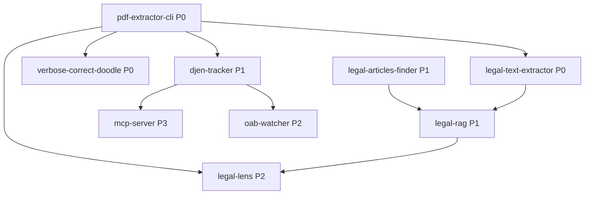

# 🗺️ ROADMAP DE DESENVOLVIMENTO - PROJETOS PRIORITÁRIOS

**Data**: 2025-11-20
**Versão**: 1.0
**Baseado em**: Auditoria .claude/ + Análise de projetos PDF

---

## EXECUTIVE SUMMARY

Este roadmap organiza os projetos do repositório em **4 prioridades** baseadas em:
1. **Impacto técnico** - Completude de funcionalidade core
2. **Dependências** - Projetos que desbloqueiam outros
3. **Estado atual** - Maturidade e documentação
4. **Domínio legal** - Relevância para automação jurídica

---

## CRITÉRIOS DE PRIORIZAÇÃO

| Critério | Peso | Descrição |
|----------|------|-----------|
| **Completude** | 30% | Projeto tem funcionalidade MVP completa? |
| **Documentação** | 20% | README, agent definition, testes existem? |
| **Dependências** | 25% | Outros projetos dependem deste? |
| **Uso Real** | 25% | Projeto resolve problema real hoje? |

---

## P0 - CRÍTICO (IMEDIATO - 1-2 SEMANAS)

### 🔴 1. pdf-extractor-cli (legal-extraction/)

**Status**: ✅ MVP Completo (Fase 1)
**Próximo**: Fase 2 - OCR Integration

**Por que P0?**
- ✅ CLI funcional (75+ padrões, 7 sistemas, auto-detecção)
- ✅ Documentação excelente (README.md completo)
- ✅ Arquitetura portável (core independente de CLI)
- 🚀 **Bloqueador**: Outros projetos dependem de extração confiável

**Tarefas**:
1. **Integração PaddleOCR** (Fase 2)
   - Detecção automática de PDFs escaneados
   - Processamento paralelo de páginas
   - Barra de progresso
   - **Estimativa**: 3-5 dias

2. **Testes End-to-End**
   - 7 sistemas judiciais (PJE, ESAJ, EPROC, PROJUDI, STF, STJ, genérico)
   - Métricas: CER <0.5%, WER <2.5%, redução ruído 15-30%
   - **Estimativa**: 2 dias

3. **Portabilidade para Backend**
   - Criar módulo Python importável
   - API programática (não apenas CLI)
   - **Estimativa**: 1 dia

**Entregável**: pdf-extractor-cli v2.0 com OCR production-ready

---

### 🔴 2. legal-text-extractor (agentes/)

**Status**: ✅ Fase 2 Milestone 3 Completo (Self-Improvement System)
**Próximo**: Fase 2 Milestone 4 - End-to-End Testing

**Por que P0?**
- ✅ SDK Integration completo (rate limiting, retry logic)
- ✅ Learning System completo (pattern extraction, few-shot)
- ✅ Self-Improvement completo (prompt versioning, A/B testing)
- ⚠️ **Agent definition genérica** (issue #1 da auditoria)

**Tarefas**:
1. **End-to-End Testing** (Milestone 4)
   - Testes com documentos reais (PJE, ESAJ, STF, STJ)
   - Validação de seções extraídas (fuzzy matching)
   - Métricas de precision/recall/F1
   - **Estimativa**: 3 dias

2. **Expandir Agent Definition**
   - `.claude/agents/legal-text-extractor.md` (de ~100 para ~250 linhas)
   - Detalhar capacidades (OCR, sistemas judiciais, SDK integration)
   - Adicionar exemplos de uso
   - **Estimativa**: 1 dia

3. **Integração com pdf-extractor-cli**
   - Usar pdf-extractor-cli como engine base
   - Legal-text-extractor adiciona camada Claude SDK (análise semântica)
   - **Estimativa**: 2 dias

**Entregável**: legal-text-extractor Fase 2 completo + agent definition robusta

---

### 🔴 3. verbose-correct-doodle (legal-extraction/)

**Status**: ✅ v4.1.3 Production (Web UI)
**Próximo**: Bateria de Testes Obrigatórios

**Por que P0?**
- ✅ Interface web 100% offline/client-side
- ✅ OCR automático (Tesseract.js)
- ✅ Processamento em lote (múltiplos PDFs)
- ✅ Análise de 13 tipos de peças jurídicas
- ⚠️ **Testes pendentes** (8 testes obrigatórios)

**Tarefas**:
1. **Bateria de Testes (README.md linhas 224-296)**
   - Teste 1-6: PJE, ESAJ, STF, STJ, EPROC, PROJUDI
   - Teste 7: PDF escaneado (OCR)
   - Teste 8: Blacklist customizada
   - Métricas: CER <0.5%, WER <2.5%, confiança >85%
   - **Estimativa**: 3 dias

2. **Documentação de Resultados**
   - Criar `TEST_RESULTS.md` com métricas de cada sistema
   - Screenshot de cada teste
   - **Estimativa**: 1 dia

3. **Fix de Issues Encontrados nos Testes**
   - Ajustes de padrões regex
   - Refinamento de detecção de sistema
   - **Estimativa**: 2 dias

**Entregável**: verbose-correct-doodle v4.1.3 validado com testes completos

---

## P1 - ALTA PRIORIDADE (2-4 SEMANAS)

### 🟡 4. legal-articles-finder (agentes/)

**Status**: ✅ Funcional (corpus SQLite, parser robusto)
**Próximo**: Expansão de corpus + integração com RAG

**Por que P1?**
- ✅ Agent definition robusta (5KB)
- ✅ Corpus local SQLite (CF, CC, CPC, CPP, CP, CLT, CDC, ECA, CTN)
- ✅ Output JSON/Markdown
- 🚀 **Habilita**: legal-rag, análise semântica de citações

**Tarefas**:
1. **Expansão de Corpus**
   - Adicionar leis faltantes (Lei 13.105/2015 CPC novo, Lei 14.133/2021 Licitações)
   - Atualizar corpus (últimas alterações legislativas)
   - **Estimativa**: 3 dias

2. **Testes de Parser**
   - Testar citações complexas (Art. 5º, inciso IV, alínea b, § 2º)
   - Testar citações cruzadas (múltiplas leis em uma frase)
   - **Estimativa**: 2 dias

3. **Integração com legal-rag**
   - Exportar artigos extraídos para índice RAG
   - Criar pipeline automático
   - **Estimativa**: 2 dias

**Entregável**: legal-articles-finder v2.0 com corpus expandido + integração RAG

---

### 🟡 5. legal-rag (agentes/)

**Status**: ⚠️ Em desenvolvimento (estrutura inicial)
**Próximo**: Implementação de indexing + retrieval

**Por que P1?**
- 🚀 **Habilita**: Busca semântica em documentos jurídicos
- 🚀 **Depende de**: legal-articles-finder, pdf-extractor-cli
- ⚠️ **Estrutura pronta**, mas implementação pendente

**Tarefas**:
1. **Implementar Indexing** (agentes/legal-rag/indexing/)
   - Vector store (FAISS ou Chroma)
   - Embeddings (sentence-transformers legal-specific)
   - Chunking strategy (semântico, não apenas token-based)
   - **Estimativa**: 5 dias

2. **Implementar Retrieval** (agentes/legal-rag/retrieval/)
   - Hybrid search (dense + sparse/BM25)
   - Re-ranking (cross-encoder)
   - Context window management
   - **Estimativa**: 4 dias

3. **Implementar Generation** (agentes/legal-rag/generation/)
   - Prompt engineering para domínio legal
   - Citation preservation (manter referências exatas)
   - Fact-checking layer (validar com corpus)
   - **Estimativa**: 4 dias

4. **Testes End-to-End**
   - Queries reais (ex: "O que diz o CPC sobre nulidade de citação?")
   - Métricas: precision@k, recall@k, NDCG
   - **Estimativa**: 3 dias

**Entregável**: legal-rag MVP funcional com indexing/retrieval/generation

---

### 🟡 6. djen-tracker (agentes/)

**Status**: ✅ Estrutura completa (src, tests, docs)
**Próximo**: Implementação de scraping + integração PDF extractor

**Por que P1?**
- 🚀 **Uso real**: Monitoramento diário de Diário de Justiça Eletrônico
- ✅ **Estrutura pronta**: src/, tests/, docs/, requirements.txt
- ⚠️ **Implementação pendente**: scraping, parsing, alertas

**Tarefas**:
1. **Implementar Scraping**
   - Identificar fontes DJEN (CNJ, tribunais estaduais/federais)
   - Scrapers resilientes (retry logic, rate limiting)
   - **Estimativa**: 4 dias

2. **Integração com pdf-extractor-cli**
   - Processar PDFs baixados automaticamente
   - Extrair texto limpo para análise
   - **Estimativa**: 2 dias

3. **Sistema de Alertas**
   - Detecção de palavras-chave configuráveis
   - Notificações (email, webhook, Telegram)
   - **Estimativa**: 3 dias

4. **Testes com Dados Reais**
   - Mock de DJEN para testes
   - Validação de extração de metadados (processo, partes, movimentação)
   - **Estimativa**: 2 dias

**Entregável**: djen-tracker v1.0 funcional com monitoramento automático

---

## P2 - MÉDIA PRIORIDADE (1-2 MESES)

### 🟢 7. oab-watcher (agentes/)

**Status**: ✅ Estrutura completa
**Próximo**: Implementação similar a djen-tracker

**Tarefas**:
- Scraping de Diário Oficial da OAB
- Detecção de publicações relevantes
- Sistema de alertas
- **Estimativa**: 2 semanas (após djen-tracker, reusar código)

---

### 🟢 8. legal-lens (agentes/)

**Status**: ✅ pdf_processor.py implementado
**Próximo**: Análise semântica de publicações

**Tarefas**:
- Classificação de tipos de publicação (edital, despacho, intimação)
- Extração de entidades (nomes, processos, datas)
- Integração com legal-rag para contexto
- **Estimativa**: 2 semanas

---

### 🟢 9. Skills Placeholders

**Status**: ⚠️ 4 skills sem SKILL.md (deep-parser, ocr-pro, sign-recognition, ?)
**Próximo**: Completar ou remover

**Tarefas**:
- Identificar 4º placeholder
- Decidir: completar (criar SKILL.md) ou remover diretórios vazios
- **Estimativa**: 2 dias

---

## P3 - BAIXA PRIORIDADE (3+ MESES)

### 🔵 10. aesthetic-master (agentes/)

**Status**: ⚠️ Config UI/design
**Próximo**: Definir escopo claro

**Tarefas**:
- Documentar propósito e uso
- Implementar se necessário
- **Estimativa**: TBD

---

### 🔵 11. MCP Server (mcp-servers/djen-mcp-server/)

**Status**: ✅ Estrutura pronta
**Próximo**: Implementação após djen-tracker

**Tarefas**:
- Expor djen-tracker via Model Context Protocol
- Integração com Claude Desktop
- **Estimativa**: 1 semana (após djen-tracker P1)

---

## DEPENDÊNCIAS ENTRE PROJETOS

**Legenda**:
- **Setas** = "é usado por" ou "habilita"
- **P0, P1, P2, P3** = Níveis de prioridade

---

## MILESTONES

### Milestone 1 - Foundation (Semana 1-2)
- ✅ pdf-extractor-cli Fase 2 (OCR)
- ✅ legal-text-extractor Fase 2 M4 (E2E tests)
- ✅ verbose-correct-doodle bateria de testes

**Entregável**: Stack de extração de PDF production-ready

---

### Milestone 2 - Intelligence (Semana 3-6)
- ✅ legal-articles-finder v2.0 (corpus expandido)
- ✅ legal-rag MVP (indexing + retrieval + generation)
- ✅ djen-tracker v1.0 (monitoramento automático)

**Entregável**: Sistema de busca semântica + monitoramento automático

---

### Milestone 3 - Integration (Semana 7-10)
- ✅ legal-lens análise semântica
- ✅ oab-watcher v1.0
- ✅ MCP server para djen-tracker
- ✅ Skills placeholders resolvidos

**Entregável**: Sistema integrado de automação legal

---

## RECURSOS NECESSÁRIOS

### Técnicos
- **Python 3.10+** (todos os agentes)
- **Node.js 18+** (MCP server, hooks)
- **PaddleOCR** (pdf-extractor-cli Fase 2)
- **FAISS/Chroma** (legal-rag vector store)
- **sentence-transformers** (legal-rag embeddings)

### Dados
- **Corpus legal** atualizado (legal-articles-finder)
- **PDFs de teste** (7 sistemas judiciais para validação)
- **Fontes DJEN** (URLs de tribunais para scraping)

### Infraestrutura
- **venv por agente** (isolamento de dependências)
- **Git flow** (branches, commits, push)
- **Monitoring** (logs, métricas de performance)

---

## MÉTRICAS DE SUCESSO

| Projeto | Métrica | Target |
|---------|---------|--------|
| pdf-extractor-cli | CER (Character Error Rate) | <0.5% |
| pdf-extractor-cli | Redução de ruído | 15-30% |
| legal-text-extractor | F1 Score (seções) | >85% |
| verbose-correct-doodle | Confiança detecção sistema | >85% |
| legal-rag | Precision@5 | >80% |
| djen-tracker | Uptime scraping | >99% |

---

## NEXT STEPS (IMEDIATO)

1. **pdf-extractor-cli Fase 2** - Integrar PaddleOCR (3-5 dias)
2. **legal-text-extractor Milestone 4** - Testes E2E (3 dias)
3. **verbose-correct-doodle** - Bateria de testes (3 dias)
4. **Expandir legal-text-extractor.md** - Agent definition completa (1 dia)

**Total Estimado Milestone 1**: 10-12 dias úteis (2 semanas)

---

**Última Atualização**: 2025-11-20
**Próxima Revisão**: Após Milestone 1 (2 semanas)
