# Legal Text Extractor - Arquitetura

## Pipeline Principal

```mermaid
graph TB
    classDef start fill:#1a1a2e,stroke:#50FA7B,stroke-width:2px,color:#fff
    classDef stage fill:#16213e,stroke:#8BE9FD,stroke-width:2px,color:#fff
    classDef process fill:#0f3460,stroke:#BD93F9,stroke-width:1px,color:#fff
    classDef decision fill:#1a1a2e,stroke:#FF79C6,stroke-width:2px,color:#fff
    classDef output fill:#1a1a2e,stroke:#F1FA8C,stroke-width:1px,color:#fff
    classDef future fill:#1a1a2e,stroke:#6272A4,stroke-width:2px,color:#888,stroke-dasharray: 5 5

    PDF[/"📄 PDF Input"/]:::start

    subgraph STAGE1["ESTÁGIO 1: CARTÓGRAFO (step_01_layout.py)"]
        direction TB
        S1_1["Leitura Estrutura Página"]:::process
        S1_2["Detecção Sistema Judicial"]:::process
        S1_3{"PJE | ESAJ | EPROC | PROJUDI"}:::decision
        S1_4["Cálculo Histograma Densidade"]:::process
        S1_5["Identificação Picos/Tarjas"]:::process
        S1_6["Definição Safe BBox"]:::process
        S1_OUT[/"layout.json"/]:::output
    end

    subgraph STAGE2["ESTÁGIO 2: SANEADOR (step_02_vision.py)"]
        direction TB
        S2_1{"Tipo de Página?"}:::decision
        S2_BYPASS["Bypass (Digital Limpo)"]:::process
        S2_2["Rasterização (pdf2image)"]:::process
        S2_3["ImageCleaner.process_image()"]:::process

        subgraph CLEANER["ImageCleaner"]
            direction LR
            C1["detect_mode()"]:::process
            C2{"Digital ou Scanned?"}:::decision
            C3["remove_gray_watermarks()"]:::process
            C4["has_speckle_noise()"]:::process
            C5{"Tem ruído?"}:::decision
            C6["remove_speckles()"]:::process
            C7["remove_color_stamps()"]:::process
            C8["clean_dirty_scan()"]:::process
            C9["remove_speckles()"]:::process
        end

        S2_OUT[/"images/*.png"/]:::output
    end

    subgraph STAGE3["ESTÁGIO 3: EXTRATOR (step_03_extract.py)"]
        direction TB
        S3_1["Leitura layout.json + images"]:::process
        S3_2{"Método de Extração?"}:::decision
        S3_3["pdfplumber (bbox filter)"]:::process
        S3_4["Tesseract OCR"]:::process
        S3_5["Unificação Fragmentos"]:::process
        S3_6["CleaningEngine (75+ patterns)"]:::process
        S3_7["Aplicação Fronteiras"]:::process
        S3_OUT[/"final.md"/]:::output
    end

    subgraph STAGE4["ESTÁGIO 4: BIBLIOTECÁRIO (step_04_classify.py)"]
        direction TB
        S4_1["Leitura final.md"]:::process
        S4_2["Regex Cabeçalhos Jurídicos"]:::process
        S4_3["Segmentação por Peças"]:::process
        S4_OUT[/"structure.json"/]:::output
    end

    %% Conexões principais
    PDF --> STAGE1
    S1_1 --> S1_2 --> S1_3 --> S1_4 --> S1_5 --> S1_6 --> S1_OUT

    STAGE1 --> STAGE2
    S2_1 -->|"Digital Limpo"| S2_BYPASS
    S2_1 -->|"Imagem/Híbrido"| S2_2
    S2_2 --> S2_3
    S2_3 --> CLEANER
    C1 --> C2
    C2 -->|Digital| C3 --> C4 --> C5
    C5 -->|Sim| C6
    C5 -->|Não| S2_OUT
    C6 --> S2_OUT
    C2 -->|Scanned| C7 --> C8 --> C9 --> S2_OUT
    S2_BYPASS --> S2_OUT

    STAGE2 --> STAGE3
    S3_1 --> S3_2
    S3_2 -->|"Texto Digital"| S3_3
    S3_2 -->|"Imagem"| S3_4
    S3_3 --> S3_5
    S3_4 --> S3_5
    S3_5 --> S3_6 --> S3_7 --> S3_OUT

    STAGE3 -.-> STAGE4
    S4_1 --> S4_2 --> S4_3 --> S4_OUT

    %% Styling
    class STAGE1,STAGE2,STAGE3 stage
    class STAGE4 future
```



## Legenda

| Cor | Significado |
|-----|-------------|
| 🟢 Verde | Input/Output principal |
| 🔵 Azul | Estágio do pipeline |
| 🟣 Roxo | Processo interno |
| 🩷 Rosa | Decisão/Branch |
| 🟡 Amarelo | Arquivo de output |
| ⚫ Tracejado | Fase futura (não implementada) |

## Arquivos de Saída

```
outputs/{doc_id}/
├── layout.json      # Metadados de layout (Cartógrafo)
├── images/          # Imagens processadas (Saneador)
│   ├── page_001.png
│   └── page_002.png
├── final.md         # Texto extraído e limpo (Extrator)
└── structure.json   # Classificação semântica (Bibliotecário) [FUTURO]
```

## Componentes Principais

### ImageCleaner (`src/core/image_cleaner.py`)

```
┌─────────────────────────────────────────────────────────┐
│                     ImageCleaner                        │
├─────────────────────────────────────────────────────────┤
│ Modos: AUTO | DIGITAL | SCANNED                         │
├─────────────────────────────────────────────────────────┤
│ ▸ detect_mode()           → Analisa histograma          │
│ ▸ remove_gray_watermarks()→ Threshold global (>200)     │
│ ▸ has_speckle_noise()     → Detecta ruído condicional   │
│ ▸ remove_speckles()       → Median blur (3x3)           │
│ ▸ remove_color_stamps()   → HSV segmentation            │
│ ▸ clean_dirty_scan()      → Adaptive threshold          │
│ ▸ process_image()         → Orquestrador principal      │
└─────────────────────────────────────────────────────────┘
```

### CleaningEngine (`src/engines/cleaning_engine.py`)

```
┌─────────────────────────────────────────────────────────┐
│                    CleaningEngine                       │
├─────────────────────────────────────────────────────────┤
│ 75+ padrões regex para limpeza de texto                 │
├─────────────────────────────────────────────────────────┤
│ ▸ Assinaturas digitais    ▸ URLs de validação           │
│ ▸ Timestamps              ▸ Códigos hash                │
│ ▸ Números de página       ▸ Headers/footers             │
│ ▸ Tarjas laterais         ▸ Certificados                │
└─────────────────────────────────────────────────────────┘
```

---

*Última atualização: 2025-11-25*
